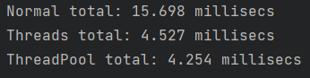
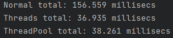
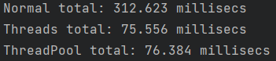
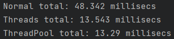
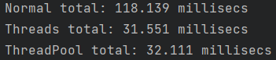
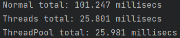
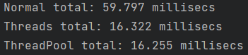
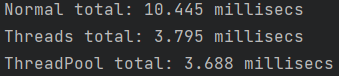
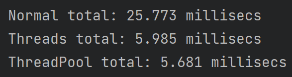
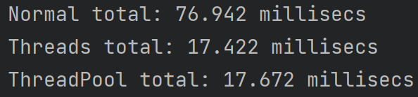

# OBJECT ORIENTED PROGRAMMING - FILES AND THREADS

## Description
The following project is divided into two parts: 
- in part A - we will explore the differences between programs that use threads,  threadpool and just run a specific set of commands. this will be down by 4 different methods - 
1. ```createTextFiles```
2. ```getNumOfLines```
3. ```getNumOfLinesThreads```
4. ```getNumOfFilesThreadPool```

- in Part B - we will create two new types that extend the functionality of java's Concurrency Framework:
1. A generic task with a Type that returns a result and may throw an exception.
   Each task has a priority used for scheduling͕ inferred from the integer value of the task͛s Type.
2. A custom thread pool class that defines a method for submitting a generic task as described in
   the section 1 to a priority queue, and a method for submitting a generic task created by a
   Callable<V> and a Type, passed as arguments.

## Part A
as Mentioned above we've created 4 different methods in thi part:
- The first method called ```createTextFiles``` is a method made in order to create a number of text files and write a different number of lines in each one, at the end of the method it returns a String array populated with the names of all the files created.
- The second method called ```getNumOfLines``` receives the String array from the first method and return the combined sum of the lines inside all the files created.
- The third method called ```getNumOfLinesThreads``` receives the String array from the first method and while using threads return the combined sum of the lines inside all the files created.
- The forth method called ```getNumOfFilesThreadPool``` receives the String array from the first method and while implementing threadpool return the combined sum of the lines inside all the files created.

We have also created a ```Main``` class in order to make sure all the methods listed above are working properly, inside this class we call each method and mesure the time each of them worked, than we ran those method inside a loop up to 1000 times and divided each case by a 1000 in order to get the average case and the most optimal results.

## FIndings
We've tested the program tem different times with ten different number of files and lines:

- 10 files



- 100 files



- 200 files



- 34 files



- 78 files



- 67 files



- 42 files



- 7 files



- 16 files



- 51 files



Form those results we can see that the real competition is between the third method - ```getNumOfLinesThreads```, and the forth method - ```getNumOfFilesThreadPool```. at the lower number of files we can see that the ThreadPool is faster than normal Threads, but at the 50 files marker we can see a power shift towards the methods that uses Threads, while at each case the method that uses a specific set of command is lest behind.
